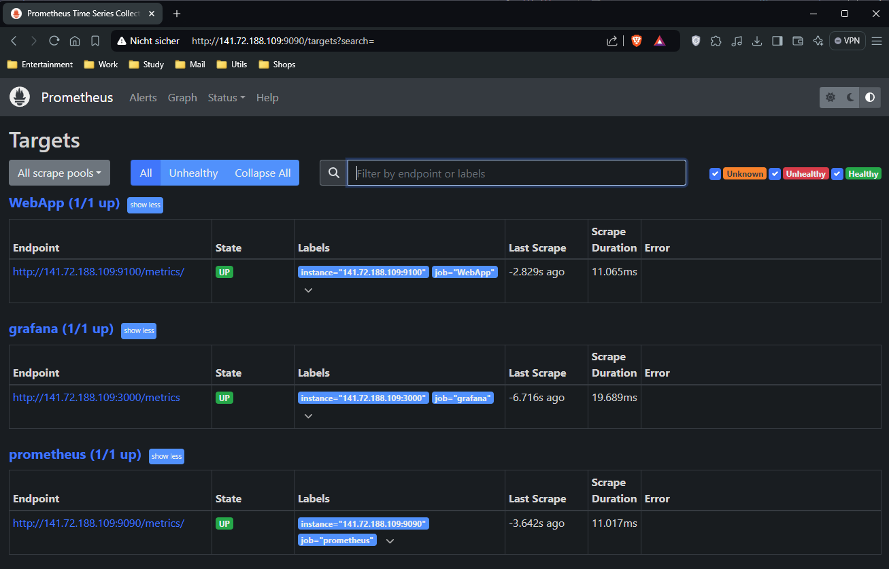

# Cloud Native Application: LaptopMetrics

**Name**: Hamza Harti | **Matrikelnummer**: 2431662 | **Modul**: W3M20035 | **Professoren**: Prof. Dr.-Ing. habil. Dennis Pfisterer & Prof. Dr. Christoph Sturm

# Table of Contents

- [Cloud Native Application: LaptopMetrics](#cloud-native-application-laptopmetrics)
- [Table of Contents](#table-of-contents)
  - [1.  Part I: Why Cloud Native Application? \[Prof. Dr. Christoph Sturm\]](#1--part-i-why-cloud-native-application-prof-dr-christoph-sturm)
    - [1.1.  Introduction](#11--introduction)
    - [1.2.  The Advantages and Disadvantages of Cloud Native Approach](#12--the-advantages-and-disadvantages-of-cloud-native-approach)
      - [1.2.1  The Advantages of Cloud Native Approach](#121--the-advantages-of-cloud-native-approach)
      - [1.2.2  The Disadvantages of Cloud Native Approach](#122--the-disadvantages-of-cloud-native-approach)
    - [1.3.  Alternatives to Cloud Native Approach](#13--alternatives-to-cloud-native-approach)
      - [1.3.1  Traditional Monolithic Applications](#131--traditional-monolithic-applications)
      - [1.3.2  Hybrid Cloud Models](#132--hybrid-cloud-models)
      - [1.3.2  Serverless Computing](#132--serverless-computing)
    - [1.4.  Data Security and The GDPR](#14--data-security-and-the-gdpr)
  - [2.  Part II: The development of a Cloud Native Application \[Prof. Dr.-Ing. habil. Dennis Pfisterer\]](#2--part-ii-the-development-of-a-cloud-native-application-prof-dr-ing-habil-dennis-pfisterer)
    - [2.1  Architecture](#21--architecture)
    - [2.2  Implementation](#22--implementation)
      - [2.2.1  Project Structure](#221--project-structure)
      - [2.2.2  Virtual Machine Provision and Configuration](#222--virtual-machine-provision-and-configuration)
        - [2.2.2.1  Virtual Machine Provision with Terraform](#2221--virtual-machine-provision-with-terraform)
        - [2.2.2.2  Virtual Machine Configuration with Ansible](#2222--virtual-machine-configuration-with-ansible)
        - [2.2.2.3  CI/CD with Github Actions](#2223--cicd-with-github-actions)
      - [2.2.3  Monitoring and Visualization](#223--monitoring-and-visualization)
        - [2.2.3.1  Monitoring with Prometheus](#2231--monitoring-with-prometheus)
        - [2.2.3.2  Visualization with Grafana](#2232--visualization-with-grafana)


##  1. <a name='part-i-why-cloud-native-app'></a> Part I: Why Cloud Native Application? [Prof. Dr. Christoph Sturm]

###  1.1. <a name='introduction'></a> Introduction

Over the last couple of years, the term "Cloud Native" has become very popular among software developers and in circles dealing with IT infrastructure. As organizations have undergone progressive digital transformation, cloud-native applications have become an essential constituent of modern IT strategies. The term "cloud-native" refers to the design, development, and deployment of applications specifically intended to exploit the scalability, resilience, and flexibility provided by the cloud. Overall, cloud-native applications are normally based on microservices architectures, managed by container orchestration systems like Kubernetes, and deployed into environments that support methodologies for continuous integration and continuous delivery. The move toward cloud-native development is a serious one and offers many benefits, specifically for applications that are rate-limited by extreme scalability, dealing with vast amounts of data, or high availability. However, like any technology solution, cloud-native approaches bring their own set of problems and drawbacks. Moreover, other strategies, including traditional monolithic architectures or hybrid cloud models, have their strengths but also limitations, which must be carefully considered in choosing the best approach for an application.

Cloud-native architectures have not only revolutionized application development, deployment, and management—offering flexibility, scalability, and resilience in ways previously unthought of—but also helped applications like *LaptopMetrics*, designed to monitor the performance of the host system, immensely. When moved to a cloud infrastructure, *LaptopMetrics* enables its users to leverage real-time monitoring, data analysis, and reporting capabilities with the very cloud-native framework in use while ensuring high availability and scalability.

###  1.2. <a name='the-advantages-and-disadvantages-of-cloud-native-approach'></a> The Advantages and Disadvantages of Cloud Native Approach

The Cloud Native approach offers various advantages that benefit the application *LaptopMetrics* after a successful implementation. However significant disadvantages present themselves, which require a great deal of considerations.

#### 1.2.1 <a name='the-advantages-of-cloud-native-approach'></a> The Advantages of Cloud Native Approach

The following table summarizes some of the advantages the Cloud Native Application inherits after Implementation:

| Feature                    | Description                                                                                     |
|----------------------------|-------------------------------------------------------------------------------------------------|
| **Scalability**            | Cloud-native architecture allows LaptopMetrics to scale resources dynamically.                  |
| **Resilience**             | Ensures continuous availability even in the event of component failures.                        |
| **Flexibility and Agility**| Enables rapid deployment and updates, allowing the app to adapt quickly.                       |
| **Cost Efficiency**        | Optimizes resource usage and costs by scaling according to demand.                              |
| **Improved Developer Productivity** | Enhances development speed and collaboration through microservices and CI/CD.           |

1. **Scalability**  
   Cloud-native architecture allows LaptopMetrics to scale resources dynamically based on demand. This is crucial for handling fluctuating loads. During high demand, additional microservice instances can be deployed to manage the load, ensuring optimal performance. Conversely, during low activity periods, resources can be scaled down to optimize costs without sacrificing performance.

2. **Resilience**  
   LaptopMetrics benefits from high availability and fault tolerance due to its microservices architecture and cloud platform deployment (Kubernetes). If a service fails, such as the data collection service, it can be automatically restarted or redirected to a healthy instance. This minimizes downtime and ensures that critical monitoring functions continue to operate without interruption, which is essential for monitoring.

3. **Flexibility and Agility**  
   The cloud-native architecture provides LaptopMetrics with the ability to adapt quickly to changing requirements. Updates, such as new performance metrics or features, can be developed, tested, and deployed rapidly. Containers and CI/CD pipelines facilitate this agility, allowing the development team to implement changes with minimal disruption and keep the application aligned with user needs.

4. **Cost Efficiency**  
   LaptopMetrics benefits from cost efficiency by utilizing only the necessary resources at any given time. This is particularly advantageous for handling variable workloads. For instance, during large-scale deployments, the application can scale up to manage the increased load and then scale down afterward, reducing costs and ensuring resource efficiency.

5. **Improved Developer Productivity**  
   Enhanced productivity is achieved through microservices, containers, and CI/CD practices. Development teams can work on different application components simultaneously, reducing bottlenecks and accelerating feature delivery. Containerization ensures consistent code execution across development, testing, and production environments, minimizing environment-related issues and allowing developers to focus on delivering value.

#### 1.2.2 <a name='the-disadvantages-of-cloud-native-approach'></a> The Disadvantages of Cloud Native Approach

When opting for a cloud native approach, the developer should take into account various considerations. Some of the main considerations are featured in the following table:


| Consideration          | Description                                                                                             |
|------------------------|---------------------------------------------------------------------------------------------------------|
| **Increased Complexity** | Cloud-native architecture introduces complexity in development and management.                        |
| **Operational Overhead** | Requires sophisticated monitoring and management tools, increasing operational overhead.                |
| **Vendor Lock-In**      | Dependency on specific cloud providers could limit flexibility and options for future migrations.       |
| **Security Concerns**   | Increases the attack surface and necessitates robust security practices to protect against vulnerabilities. |

1. **Increased Complexity**  
   One of the primary disadvantages of deploying LaptopMetrics as a cloud-native application is the increased complexity. The microservices architecture, while offering scalability and flexibility, also introduces a level of complexity in terms of development, deployment, and management. Each service within LaptopMetrics must communicate effectively with others, requiring careful orchestration and management. This complexity can lead to challenges in debugging issues or making changes, especially as the application grows in size and scope.

2. **Operational Overhead**  
   Operational overhead is another concern. Managing a cloud-native application like LaptopMetrics requires sophisticated monitoring, logging, and tracing solutions to ensure that all microservices are functioning correctly and efficiently. This increases the operational burden on the team, who must also manage the underlying infrastructure, handle updates, and ensure that the application remains secure. The need for specialized tools and expertise can also add to the overall cost and complexity.

3. **Vendor Lock-In**  
   Vendor lock-in is a potential risk for LaptopMetrics, particularly if the application relies heavily on specific cloud provider services. For example, if LaptopMetrics uses AWS-specific services for data storage or processing, moving to a different cloud provider could be challenging and costly. This reliance on a single vendor could limit the application's flexibility and make it difficult to take advantage of more competitive offerings from other providers.

4. **Security Concerns**  
   Security concerns are heightened in a cloud-native environment due to the increased attack surface. LaptopMetrics, like any cloud-native application, must ensure that data is secure at all times—whether in transit, at rest, or during processing. The distributed nature of microservices and the use of third-party services require robust security practices, which can be resource-intensive and complex to implement.

###  1.3. <a name='alternatives-to-cloud-native-approach'></a> Alternatives to Cloud Native Approach

While there are many benefits to cloud-native development, that does not make it the only approach to application development. Depending on the organizational needs, technical specifications, or preceding infrastructure, other methodologies could be more appropriate. Three of these alternatives are traditional monolithic applications, hybrid cloud models, and serverless computing. Each of the aforementioned approaches has a unique set of benefits and shortcomings.

####  1.3.1 <a name='traditional-monolithic-applications'></a> Traditional Monolithic Applications

A traditional monolithic architecture is an alternative to cloud-native development. In a monolithic application, all components are tightly coupled and run as a single unit. While this approach simplifies development and deployment, it comes with limitations in terms of scalability, flexibility, and resilience.

Monolithic applications can be easier to develop and manage for small, simple use cases. However, as the application grows, it becomes more challenging to maintain, scale, and update. The lack of modularity means that even small changes require redeploying the entire application, leading to longer development cycles and increased risk of downtime.

####  1.3.2 <a name='hybrid-cloud-models'></a> Hybrid Cloud Models

Hybrid cloud models offer a middle ground between traditional on-premises applications and cloud-native solutions. In a hybrid cloud, organizations deploy some components of the application in the cloud while keeping others on-premises. This approach allows organizations to leverage the benefits of cloud computing while retaining control over critical infrastructure and data.

Hybrid cloud models are particularly useful for organizations with legacy systems that cannot be easily migrated to the cloud. However, managing a hybrid environment can be complex and requires careful coordination between on-premises and cloud-based components.

####  1.3.2 <a name='serverless-computing'></a> Serverless Computing

Serverless computing is another alternative to cloud-native development. In a serverless model, the cloud provider automatically manages the infrastructure, scaling resources up and down as needed. Developers focus solely on writing code, while the cloud provider handles deployment, scaling, and maintenance.

Serverless computing offers many of the benefits of cloud-native development, such as scalability and cost-efficiency, without the need to manage infrastructure. However, it also comes with limitations, such as potential latency issues, cold start times, and limited control over the environment.

###  1.4. <a name='data-security-and-the-gdpr'></a> Data Security and The GDPR

Security is of utmost importance, particularly regarding data security in the context of Cloud Native Applications, which raises a significant question: How can the security of the handled data be ensured, and what impact do legal regulations such as the General Data Protection Regulation (GDPR) have on the application? 

| **Security Aspect**                  | **Description**                                                                          |
|--------------------------------------|------------------------------------------------------------------------------------------|
| **Encryption**                       | Ensures that data is protected both in transit and at rest.                              |
| **Identity and Access Management (IAM)** | Controls access to sensitive data through fine-grained permissions.                       |
| **Secure Software Development Lifecycle (SDLC)** | Integrates security throughout the development process.                                    |
| **Container Security**               | Protects the integrity of containerized applications and their dependencies.              |
| **Network Security**                 | Safeguards communication between microservices and external systems.                     |

1. **Encryption**
   Data security is a great concern for LaptopMetrics, especially given the sensitive nature of performance data. Encryption is to be used both at rest and in transit. Performance metrics collected from the host are to be encrypted before being transmitted to the cloud, ensuring that data cannot be intercepted or tampered with. Similarly, data stored in cloud databases is encrypted at rest, protecting it from unauthorized access even if the storage medium is compromised.

2. **Controlled Access**
   Access to the virtual machine (VM) provided by Openstack is restricted to authorized personnel only. An SSH key is required to establish an encrypted connection to the VM, ensuring protection against unauthorized access.

3. **Secure Software Development Lifecycle (SDLC)**
   Security is to be integrated throughout the SDLC to identify and mitigate vulnerabilities early in the development process. This should includes regular code reviews, automated security testing, and continuous monitoring for potential security threats. Embedding security practices throughout the development lifecycle helps reduce the risk of security breaches and ensures that the application remains secure as it evolves.

4. **Container Security**
   For LaptopMetrics, deployed as a cloud-native application, container security is essential. Containers are to be built from trusted images, regularly updated, and scanned for vulnerabilities. Runtime security measures are also to be in place to detect and prevent malicious activities, such as unauthorized access to containers or abnormal behavior that could indicate a security breach.

5. **Network Security**
   Securing the network infrastructure supporting LaptopMetrics is critical. Measures such as network segmentation, firewalls, and security groups control traffic flow between microservices and external systems. Communication between microservices is to be encrypted, and secure protocols are to be used to ensure that data is not exposed to unauthorized parties. These measures help protect data and ensure compliance with necessary security standards.

Most of the security Aspects are not implemented in the development of the cloud native application, however they should be considered, especially of the application is to be moved into production. Ownership rights to the data should also be clarified, ideally through Service Level Agreements (SLAs) and Service Level Objectives (SLOs). Such agreements should specify whether the data is considered the property of the user or the provider. 

Data ownership rights can vary depending on the laws and regulations of different countries. Therefore, it is important to ensure that agreements with the cloud provider comply with the legal requirements of the respective country, especially when personal data is collected.  

##  2. <a name='part-ii-the-development-of-cloud-native-application'></a> Part II: The development of a Cloud Native Application [Prof. Dr.-Ing. habil. Dennis Pfisterer]

### 2.1 <a name='architecture'></a> Architecture

LaptopMetrics is a C# web application developed using ASP.NET Core v8.0. The application's purpose is to run on the host system and gather real-time data on the state of the CPU, RAM, storage, and network connectivity. Instead of developing a frontend to visualize the retrieved data, a decision was made to use Grafana for this purpose. The backend is supported by MyAPI, a REST API that provides a Swagger UI for developers to test the app and access all endpoints. The application offers one endpoint, with a POST operation to expose the scraped data.

|  | 
|:--:| 
| *Architecture Overview* |

In addition to the REST API handling the backend, Prometheus libraries for .NET applications are also included. On one hand, these libraries allow developers to use predefined functions to append the /metrics endpoint with the necessary data, formatted in a way that Prometheus can easily target. On the other hand, this setup enables monitoring of the application; the Prometheus dependency injects the app with the necessary metrics, which can then be scraped by Prometheus.

Once the application is set up and ready, it should expose the host system's metrics at the `/metrics` endpoint, along with its own performance data. Prometheus will retrieve this data and expose it to Grafana, which will then allow the creation of dashboards for each component.

The virtual machine hosted in the cloud is divided into two environments: a Docker environment and a Kubernetes environment. Each environment offers a range of benefits, and the idea is to leverage the strengths of each one.

The Docker environment is configured as a development and testing environment, offering benefits such as *simplicity*, *quick iteration*, and *direct control*. Additionally, it ensures *service continuity* in case of downtime in the production environment.

| **Advantage**          | **Description**                                                                                                                                               |
|------------------------|---------------------------------------------------------------------------------------------------------------------------------------------------------------|
| **Simplicity**         | Docker is easy to set up, making it ideal for quickly getting your LaptopMetrics application running in a local or testing environment.                        |
| **Quick Iteration**    | Docker allows for rapid prototyping, unit testing, and debugging, which speeds up the development cycle of your application.                                   |
| **Direct Control**     | Provides hands-on management of containers, making it easier to start, stop, and interact with the application during development.                             |
| **Service Continuity** | Docker can act as a fallback environment if Kubernetes encounters downtime, ensuring your application remains accessible.                                      |

The Kubernetes environment is configured as the production environment, offering *scalability*, *load balancing*, *high availability*, *resource optimization*, and *advanced orchestration*.

| **Advantage**              | **Description**                                                                                                                                                     |
|----------------------------|---------------------------------------------------------------------------------------------------------------------------------------------------------------------|
| **Scalability**            | Kubernetes supports advanced scaling capabilities, which is critical for handling high traffic in your LaptopMetrics application.                                     |
| **Load Balancing**         | Automatically manages load distribution across your cluster, ensuring that the application remains responsive under varying loads.                                    |
| **High Availability**      | Kubernetes provides redundancy and automatic failover, which enhances the reliability and uptime of your application.                                                |
| **Resource Optimization**  | Kubernetes dynamically manages resources, which can optimize costs and performance in production environments.                                                       |
| **Advanced Orchestration** | Facilitates complex tasks like rolling updates, self-healing, and automatic scaling, making it ideal for managing your application in production.                    |

When Docker is set up, it should run the images for LaptopMetrics, Prometheus, and Grafana. Each service can be accessed from the internet using the floating IP address, which allows external access to the virtual machine hosted in OpenStack, and the corresponding port `http://<Virtual Machine IP>:<Image Port>`. LaptopMetrics is assigned to port 9100, Prometheus to 9090, and Grafana to 3000.

Using Docker Engine, Minikube creates a Kubernetes cluster to host pods for LaptopMetrics, Grafana, and Prometheus. LaptopMetrics is configured with a simple ingress controller, which can resolve the hostname set for LaptopMetrics (app.laptopmonitoring.com) and direct traffic to the application. As mentioned earlier, since the application does not require a user interface, accessing http://app.laptopmonitoring.com will return an empty page. However, using the `/metrics` endpoint should return the scraped data, including both the internal stats of the application and the performance data of the host machine.

NodePort is also used for Grafana and Prometheus, with the aim of exposing their traffic to the virtual machine locally for debugging and testing purposes. Accessing the Minikube fixed IP address and the designated ports—30020 for Grafana and 30010 for Prometheus—will allow access to the pods outside of the Kubernetes Cluster.

Internally, Prometheus can scrape the data exposed by Grafana, the application, and itself using the name of each service and the assigned internal port.

|  |
|:--:| 
| *Swagger UI for the backend* |

|  |
|:--:| 
| *Grafana Dashboard for the frontend* |

### 2.2 <a name='implementation'></a> Implementation

#### 2.2.1 <a name='project-structure'></a> Project Structure

The project is structured as Monorepo, meaning that the source code of the application and the infrastructure are in the same repository, here is a directory layout of the project:

```html
LaptopMetrics/                      <!--Main Directory-->
┣ .github/                          <!--Automatically Build and Push-->
┃ ┗ workflows/
┣ DockerCompose/                    <!--Docker Compose for Grafana, Prometheus, and LaptopMetrics-->
┃ ┣ ConfigFile_prometheus/
┃ ┗ docker-compose.yml
┣ helm_charts/                      <!--Helm files to deploy Kubernetes Cluster-->
┃ ┗ LaptopMetricsApp/
┣ img/                              <!--Media Used in Documentation-->
┃ ┣ API_Swagger.png
┃ ┣ Architecture.svg
┃ ┣ LaptopMetrics_Grafana_1.png
┃ ┗ LaptopMetrics_Grafana_2.png
┣ LaptopMetricsApp/                 <!--C# Source Code to LaptopMetrics-->
┃ ┣ bin/
┃ ┣ obj/
┃ ┣ Properties/
┃ ┣ appsettings.Development.json
┃ ┣ appsettings.json
┃ ┣ C#_Project.csproj
┃ ┣ C#_Project.http
┃ ┣ C#_Project.sln
┃ ┣ Dockerfile
┃ ┣ Program.cs
┃ ┗ SystemMonitoringApp.cs
┣ Terraform/                        <!--Terraform files for the provision of the Virtual Machine-->
┃ ┣ .terraform/
┃ ┣ Ansible/                        <!--Ansible files for the configuration of the Virtual Machine-->
┃ ┣ .terraform.lock.hcl
┃ ┣ main.tf
┃ ┣ terraform.tfstate
┃ ┣ terraform.tfstate.backup
┃ ┣ terraform.tfvars
┃ ┗ variables.tf
┣ hosts.cfg                         <!--Automatically generated, Contained the Floating IP address of the VM-->
┗ README.md                         <!--Documentation-->
```
| **Folder**           | **Description**                                                                                                                                                            |
|----------------------|----------------------------------------------------------------------------------------------------------------------------------------------------------------------------|
| **DockerCompose**    | Contains the files required to deploy the images for LaptopMetrics, Prometheus, and Grafana. These are used during the configuration process of the Virtual Machine to set up the Docker environment and run the images. |
| **helm_charts**      | Contains the necessary files to deploy the Kubernetes cluster for LaptopMetrics, Prometheus, and Grafana.                                                                   |
| **Img**              | Holds the media files used in the documentation.                                                                                                                            |
| **LaptopMetrics**    | Contains the source code for the LaptopMetrics application.                                                                                                                 |
| **Terraform**        | Contains the Terraform configuration files for provisioning the Virtual Machine in OpenStack. Additionally, it includes a subfolder for the Ansible playbooks to configure the Virtual Machine with the necessary requirements. |
| **.github/workflows**| Defines the automated CI/CD processes that run after push or pull actions on the main branch.                                                                               |

#### 2.2.2 <a name='virtual-machine-setup-and-configuration'></a> Virtual Machine Provision and Configuration

##### 2.2.2.1 <a name='virtual-machine-provision-terraform'></a> Virtual Machine Provision with Terraform

As mentioned previously, Terraform is an infrastructure-as-code tool that allows you to define and manage an infrastructure in a declarative configuration language. In this project, Terraform is configured to work with the OpenStack provider, enabling the automated provisioning and management of Virtual Machine, that will host Docker and Kubernetes in an OpenStack environment. The `main.tf` file contains the core configuration, including resource definitions and provider settings. The `variables.tf` file defines the input variables used in the configuration, while the `terraform.tfvars` file stores the values for these variables, allowing for easy customization of the environment.

Running the followings commands, will result in the creation of a virtual machine, with the configuration specified in the terraform files:

```bash
# Change to terraform Directory
cd terraform

# Download provider resources
terraform init

# Apply the deployment
terraform apply
```
|  |
|:--:| 
| *Virtual Machine Provision with Terraform in Openstack* |

After running the command successfuly the VM could be accessed through the generated floating IP address in the hosts.cfg file and the user name which is ubuntu by default. The use of the key generated in openstack platform is necessary:

```bash
# Change to Ansible Directory
cd Ansible

# Establish ssh connection
ssh -i Key/Hamza_Key.pem ubuntu@141.72.188.109
```
|  |
|:--:| 
| *SSH Connection to The VM* |


##### 2.2.2.2 <a name='virtual-machine-configuration-ansible'></a> Virtual Machine Configuration with Ansible

Ansible is located in a subfolder within the main Terraform directory and contains all the necessary playbooks to configure the Virtual Machine (VM). 

```html
Ansible/                         <!--Main Directory-->
┣ docker/                        <!--Contains Ansible Playbook to setup docker Images in VM-->
┃ ┣ ansible.cfg
┃ ┣ docker_hub.yml               <!--Ansible Playbook to Setup Docker Images-->
┃ ┗ docker_hub_credentials.yml   <!--Credentials to connect to Docker Hub-->
┣ Key/
┃ ┗ Hamza_Key.pem                <!--Key to establish connection with the VM-->
┣ ansible.cfg
┣ deploy-helm.yml                <!--Ansible Playbook to setup Helm-->
┣ deploy-k8s.yml                 <!--Ansible Playbook to install Docker and Kubernetes-->
┗ hosts.tpl                      <!--Template file used by terraform to putput the hosts IP address-->
```

By the end of the process, the VM should be running both the Docker and Kubernetes environments. The process is divided into three steps:

1. **First Step:** 
- The first playbook installs all required system packages and essential tools, including Docker and Kubernetes.

```bash
# Run Ansible Playbook
ansible-playbook -i ../../hosts.cfg deploy-k8s.yml --private-key Key/Hamza_Key.pm
```

|  |
|:--:| 
| *First Step Process* |

2. **Second Step:** 
- This step focuses on setting up the Docker environment and running all required images (LaptopMetrics, Prometheus, Grafana) using Docker Compose. The necessary Docker Compose files are located in the `DockerCompose` folder.
- Additionally, the source code of LaptopMetrics is copied to the host, built, and pushed to Docker Hub. The Docker Compose setup then pulls the application image.

```bash
#Change Directory to docker
cd docker

# Run Ansible Playbook
ansible-playbook -i ../../../hosts.cfg deploy-docker.yml --private-key Key/Hamza_Key.pm --ask-vault-pass
```
   
|  |
|:--:| 
| *Second Step Process* |
   
   - By the end of this step, the images should be up and running. You can check the state of the running Docker images with the following command:

```bash
# Show running images
docker ps
```
   
|  |
|:--:| 
| *Running Images in Docker* |

3. **Third Step:**
- In this step, the Kubernetes cluster is deployed using Minikube with Docker as the engine. A fixed IP address must be set for Minikube, which is used to set up a domain name for Ingress in `/etc/hosts`. In this project, the IP address is set to `192.168.49.2`, ensuring that the IP is consistent each time the Minikube cluster is deployed.  
- After starting Minikube, the `helm_charts` directory is copied to the host machine, and Kubernetes is deployed.
   
```bash
# Run Ansible Playbook
ansible-playbook -i ../../hosts.cfg deploy-helm.yml --private-key Key/Hamza_Key.pm
```
   
|  |
|:--:| 
| *Third Step Process* |
   
   - To check the status of the pods, services, and Ingress, run the following command:

```bash
#Show kubernetes Services, Pods, and Ingress
kubectl get svc,po,ingress
```
   
|  |
|:--:| 
| *The Services, Pods, and Ingress running in Kubernetes* |

##### 2.2.2.3 <a name='ci-cd-with-github-actions'></a> CI/CD with Github Actions

GitHub Actions are used to automate the continuous integration (CI) process for building and pushing the LaptopMetrics Docker image whenever changes are made to the main branch. Triggered by push and pull request events on the main branch, the workflow runs on the latest Ubuntu environment. It begins by checking out the repository's code using the `actions/checkout` action. The workflow then logs into Docker Hub using the `docker/login-action`, leveraging secure credentials stored in GitHub Secrets. After setting up Docker Buildx for advanced build options, the workflow proceeds to build the Docker image from the LaptopMetrics main directory and pushes it to Docker Hub with the `latest` tag. Finally, it logs out from Docker Hub to ensure secure handling of credentials.

|  |
|:--:| 
| *CI Process* |

#### 2.2.3 <a name='monitoring-and-visualization'></a> Monitoring and Visualization

##### 2.2.3.1 <a name='monitoring-with-prometheus'></a> Monitoring with Prometheus

As mentioned previously, Prometheus is configured to monitor itself, Grafana, and LaptopMetrics. Since LaptopMetrics is a .NET application, its `/metrics` endpoint provides not only the data scraped from the host machine but also the performance metrics of the application itself.

|  |
|:--:| 
| *Prometheus Targets* |

In the Docker environment, Prometheus can be accessed through the floating IP address of the Virtual Machine on port `9090`.

|  |
|:--:| 
| *Prometheus in Docker Environment* |


However, accessing Prometheus in the Kubernetes environment requires additional steps. First, a NodePort service is needed to expose Prometheus outside of the Kubernetes cluster. After setting up the NodePort, An SSH tunnel with port forwarding using the following command:

```bash
ssh -i Key/Hamza_Key.pem -L 3001:192.168.49.2:30010 -N ubuntu@141.72.188.109 -v
```

This command forwards traffic from the local port `3001` to port `30010` on the virtual machine (141.72.188.109), allowing the access to Prometheus running in the Kubernetes cluster through http://localhost:3001.

|  |
|:--:| 
| *Prometheus in Kubernetes Environment* |

##### 2.2.3.2 <a name='visulatization-with-grafana'></a> Visualization with Grafana

Grafana is used to visualize all the data scraped by Prometheus, and it is also configured to expose its own metrics to Prometheus. Each target has its own dedicated dashboard created for it.

|  |
|:--:| 
| *Grafana Dashboards* |

Similar to Prometheus, Grafana can be accessed in the Docker environment through the floating IP address of the virtual machine on port `3000`.

|  |
|:--:| 
| *Grafana in Docker Environment* |

In the Kubernetes environment, a similar technique is used to access Grafana, but with a different port. You can use the following SSH command to create a tunnel with port forwarding:

```bash
ssh -i Key/Hamza_Key.pem -L 3002:192.168.49.2:30020 -N ubuntu@141.72.188.109 -v
```

This command forwards traffic from the local port `3002` to the port `30020` on the virtual machine (141.72.188.109), where Grafana is exposed in the Kubernetes cluster, allowing access via http://localhost:3002.

|  |
|:--:| 
| *Grafana in Kubernetes Environment* |